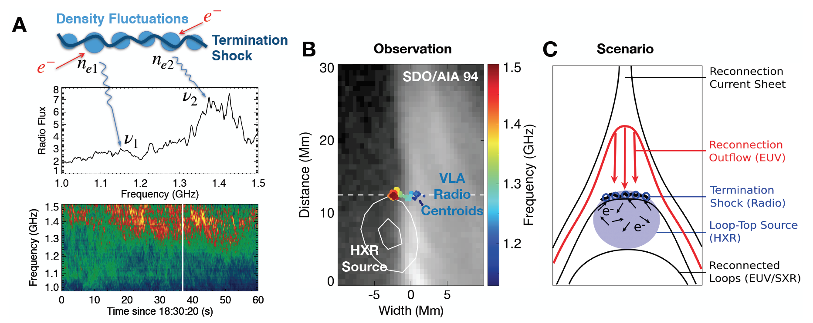
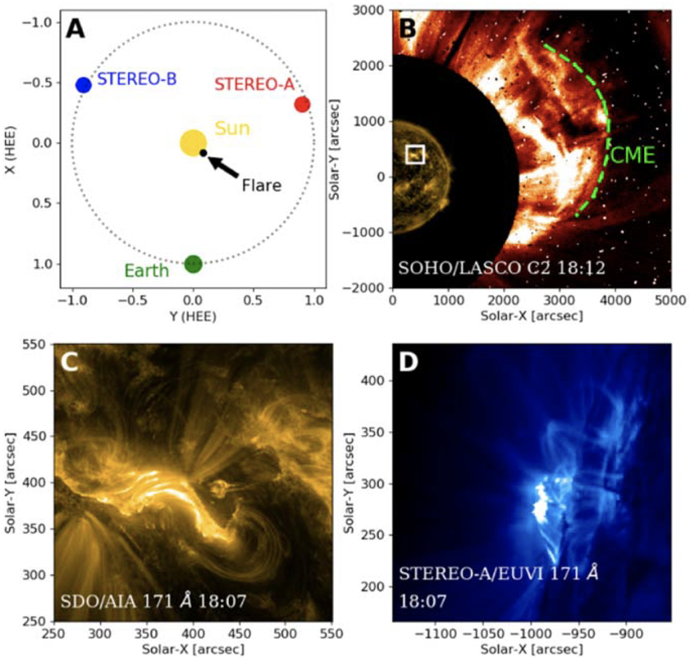
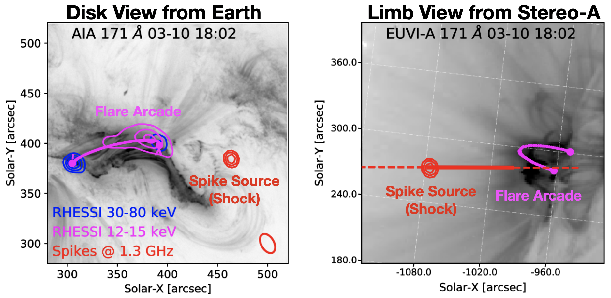
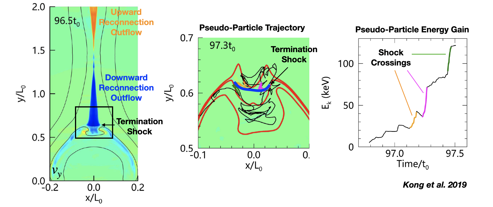

In many space and astrophysical plasma contexts, shocks are considered one of the most important mechanisms for accelerating charged particles to high energies. One of the most well-known shock types on the Sun are shocks driven by coronal mass ejections (see, e.g., [Morosan et al. 2019](https://ui.adsabs.harvard.edu/abs/2019NatAs...3..452M/abstract)). There is another type of shocks in solar flares, known as the "solar flare termination shocks," which are often incorporated within the framework of the [standard solar flare model](http://www.astro.gla.ac.uk/cartoons/Shibata_1995ApJ...451L..83S_FLA.html) as a potential particle accelerator in flares. Particularly, they are depicted in some of the most well-known schematics of the standard flare model ([Masuda et al. 1994](https://ui.adsabs.harvard.edu/abs/1994Natur.371..495M/abstract); [Shibata et al. 1995](https://ui.adsabs.harvard.edu/abs/1995ApJ...451L..83S/abstract)). Historically, these shocks have received limited attention in the literature, largely due to the scarcity of observational evidence as well as detailed modeling studies. This post briefly introduces our series of recent works that have helped rejuvenate the study of such shocks.   

### Solar Flare Termination Shock

> <em>A "Termination Shock", induced by super-magnetosonic plasma outflows, can form above the flare arcade.</em>

A <strong>fast-mode shock</strong> can form at the top of flare arcades provided that the speed of reconnection outflows impinging upon the arcades exceeds the local fast-mode magnetosonic speed. Such shocks can accelerate electrons to nonthermal energies ([Tsuneta & Naito 1998](https://ui.adsabs.harvard.edu/abs/1998ApJ...495L..67T/abstract); [Guo et al. 2012](https://ui.adsabs.harvard.edu/abs/2012ApJ...753...28G/abstract)) and can produce observable radio emissions (e.g., [Aurass et al. 2002](https://ui.adsabs.harvard.edu/abs/2002A%26A...384..273A/abstract)). Previously, in [Chen et al. 2015, Science](https://ui.adsabs.harvard.edu/abs/2015Sci...350.1238C/abstract), we used observations from the [Karl G. Jansky Very Large Array](https://science.nrao.edu/facilities/vla) (VLA) to image a type of radio bursts called "stochastic spike bursts." The radio centroids outline a dynamic shock surface, located at the ending point of fast plasma downflows and above a hard X-ray looptop source (Fig. 1). Most notably, the study showed a <strong><em>reduction of the accelerated electron population during a temporary disruption of the shock</em></strong>, implicating a crucial role the shock may play as an electron accelerator. 

*Fig. 1: Schematic of the flare termination shock and the associated radio bursts shown in A. The shock front outlined by the radio source centroids is shown in B. (Adapted from [Chen et al. 2015](https://ui.adsabs.harvard.edu/abs/2015Sci...350.1238C/abstract))*

### Shocked Material

> <em>A shock can compress the material across its front with observable radio signatures.</em>

A shock can compress the material across the shock front, resulting in a denser plasma in its downstream region. Because the emission frequency of plasma radiation (that falls within radio wavelengths under conditions in the solar corona) scales with the square root of the plasma density, the radio emission frequency can be used as a probe for such plasma compression across shocks. In particular, the denser, downstream plasma will emit at a slightly higher frequency than its less dense upstream counterpart, causing a slight frequency separation in the radio spectrogram. Such a "split-band" feature has been previously observed in type II radio bursts associated with CME-driven shocks (e.g., [Chrysaphi et al. 2018](https://ui.adsabs.harvard.edu/abs/2018ApJ...868...79C/abstract)), although its origin is still under debate.

In [Chen et al. 2019](https://ui.adsabs.harvard.edu/abs/2019ApJ...884...63C/abstract), we conducted a detailed study on such "split-band" feature associated with the same termination shock event reported in Chen+2015: in the spatially-resolved radio dynamic spectrum, they show as two closely spaced lanes with slightly different frequencies (see [Fig. 4 in their paper](https://arxiv.org/pdf/1908.09146.pdf)). Thanks to VLA's dynamic spectroscopic imaging capability, we can now image the split-band radio sources at both the shock upstream and downstream sides simultaneously. They are mostly co-spatial with each other, indicating that they are likely associated with the same shock front viewed nearly edge-on. The high-frequency source is located at a slightly lower height than the low-frequency source. This observation conforms very well with the shock upstream-downstream scenario, with a density compression ratio of around 1.8 (which corresponds to a shock Mach number of ~1.6).

### Shock Seen from Another Perspective

Recently, in a new study led by our graduate student [Yingjie Luo](https://binchensun.org/#people) ([Luo et al. 2021](https://ui.adsabs.harvard.edu/abs/2021ApJ...911....4L/abstract)), we have reported VLA observations of another stochastic spike burst event from an eruptive solar flare viewed from a different perspective---in Chen+2015, 2019, it was viewed by the VLA above the limb; this time, it is viewed against the solar disk. A happy coincidence is that one of [NASA's STEREO spacecraft](https://stereo.gsfc.nasa.gov/) was located at ~110 degrees west (or "ahead of") Earth's orbit, which captured this event with a simultaneous limb view (Fig. 2). Using VLA spectral imaging of the spike burst source, combined with three-dimensional reconstruction of the flare arcade seen in two different perspectives, we found that the spike source is located well above the flare arcade. 

It was somewhat surprising to find the spike source located at such a distance away from the EUV flare arcade. However, we identified a diffuse fan-like structure above the looptop in both the Earth view (seen by NASA's [Atmospheric Imaging Assembly](https://sdo.gsfc.nasa.gov/) aboard the Solar Dynamics Observatory) and the limb view by STEREO. They are likely associated with the newly reconnected field lines located <em>below</em> the termination shock, as suggested by a three-dimensional magnetodynamics (MHD) modeling work led by [Dr. Chengcai Shen @ CfA](https://pweb.cfa.harvard.edu/people/chengcai-shen) (Shen+2021, submitted).

*Fig. 2: An eruptive solar flare observed by VLA, SDO, and STEREO from two different viewing perspectives. In SDO and VLA's view, the flare was viewed against the disk (panel C), while in STEREO-A's view, it is located at the limb (panel D). (Adapted from [Luo et al. 2021](https://ui.adsabs.harvard.edu/abs/2021ApJ...911....4L/abstract))*

*Fig. 3: The termination shock, manifested as stochastic spike bursts in our interpretation, is found to be located above the solar flare arcade in both the disk- and limb-view perspective. (Adapted from [Luo et al. 2021](https://ui.adsabs.harvard.edu/abs/2021ApJ...911....4L/abstract))*

### Termination Shock as a Particle Accelerator
Although pertinent observational evidence for termination shocks as a particle accelerator has been reported (e.g., the stochastic spike bursts, the above-the-looptop "Masuda" source, and [looptop plasma flows](https://ui.adsabs.harvard.edu/abs/2018ApJ...865..161P/abstract)), understanding the physical picture has been far from complete. Particularly, linking these observational signatures with electron acceleration and transport requires macroscopic particle and emission modeling in a realistic flare reconnection geometry. We are working with our collaborators from the Los Alamos National Lab, Harvard-Smithsonian Center for Astrophysics, Shandong University, and Dartmouth College to develope such a modeling framework, which combines MHD and particle modeling as well as the subsequent observation--modeling comparison. Recently, with the newly developed macroscopic models, a pair of studies led by Dr. Xiangliang Kong (Fig. 4; see [Kong et al. 2019](https://ui.adsabs.harvard.edu/abs/2019ApJ...887L..37K/abstract) and [Kong et al. 2020](https://ui.adsabs.harvard.edu/abs/2020ApJ...905L..16K/abstract)) have demonstrated that a dynamic termination shock above the flare arcade can efficiently accelerate electrons to high energies with a power-law spectrum. We are now investigating the expected emission signatures from these shock-accelerated electrons and comparing them to the actual observations. Please stay tuned!

*Fig. 4: Macroscopic MHD and particle modeling shows that electrons are accelerated when they cross the termination shock above the flare arcade. (Adapted from [Kong et al. 2019](https://ui.adsabs.harvard.edu/abs/2019ApJ...887L..37K/abstract).)*

<em>The works discussed here are supported by NSF grants AGS-1654382, AST-1723436, AST-1735405 and NASA grants NNX17AB82G and 80NSSC20K1318 to the New Jersey Institute of Technology. </em>

#### Related Publications

* Luo, Y.; Chen, B.; Yu, S.; Bastian, T.; Krucker, S. (2021) "Radio Spectral Imaging of an M8.4 Eruptive Solar Flare: Possible Evidence of a Termination Shock." [<em>The Astrophysical Journal, 911, 4</em>](https://ui.adsabs.harvard.edu/abs/2021ApJ...911....4L/abstract)

* Kong, X.; Guo, F.; Shen, C.; Chen, B.; Chen, Y.; Giacalone, J. (2020) "Dynamical Modulation of Solar Flare Electron Acceleration due to Plasmoid-shock Interactions in the Looptop Region.", [<em>The Astrophysical Journal Letters, 905, 16</em>](https://ui.adsabs.harvard.edu/abs/2020ApJ...905L..16K/abstract)

* Kong, X.; Guo, F.; Shen, C.; Chen, B.; Chen, Y.; Musset, S.; Glesener, L.; Pongkitiwanichakul, P.; Giacalone, J. (2019) "The Acceleration and Confinement of Energetic Electrons by a Termination Shock in a Magnetic Trap: An Explanation for Nonthermal Loop-top Sources during Solar Flares", [<em>The Astrophysical Journal Letters, 887, 37</em>](https://ui.adsabs.harvard.edu/abs/2019ApJ...887L..37K/abstract)

* Chen, B.; Shen, C.; Reeves, K.; Guo F.; Yu, S. (2019) "Radio Spectroscopic Imaging of a Solar Flare Termination Shock: Split-band Feature as Evidence for Shock Compression." [<em>The Astrophysical Journal, 884, 63</em>](https://ui.adsabs.harvard.edu/abs/2019ApJ...884...63C/abstract)

* Chen, B.; Bastian, T.; Shen, C.; Gary, D.; Krucker, S.; Glesener, L. (2015) "Particle acceleration by a solar flare termination shock." [<em>Science, 350, 1238</em>](https://ui.adsabs.harvard.edu/abs/2015Sci...350.1238C/abstract)

#### Related Press Releases and Media Stories
* <em>Scientific American</em>: [Mysteriously Powerful Particles from Solar Explosions Unveiled in New Study](https://www.scientificamerican.com/article/mysteriously-powerful-particles-from-solar-explosions-unveiled-in-new-study)

* <em>NJIT Press Release</em>: [Shedding Light on Particle Acceleration in Solar Flares](https://www.eurekalert.org/pub_releases/2015-12/njio-slo112515.php) 

* <em>NRAO Press Release</em>: [VLA Yields New Insights on Solar Flares](https://public.nrao.edu/news/2013-10-01-13-11-51-4/)

* <em>CfA Press Release</em>: [New Insights into Solar Flares](https://pweb.cfa.harvard.edu/news/new-insights-solar-flares)

* <em>RHESSI Nugget</em>: [Rejuvenating Solar Flare Termination Shocks as Particle Accelerators](http://sprg.ssl.berkeley.edu/~tohban/wiki/index.php/Rejuvenating_Solar_Flare_Termination_Shocks_as_Particle_Accelerators)

* <em>CESRA Highlight</em>: [Split-Band Feature of a Solar Flare Termination Shock](http://www.astro.gla.ac.uk/users/eduard/cesra/?p=2412) 

